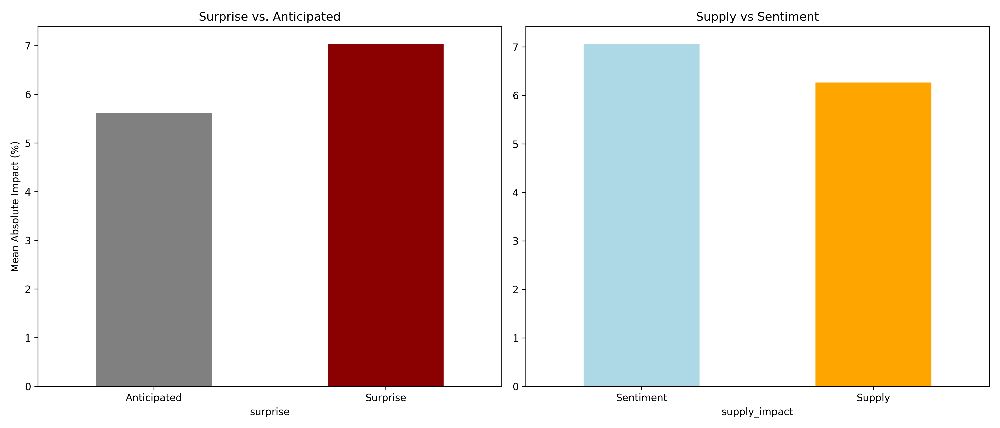

# Oil Market Impact Analysis

A Python-based data analysis project that quantifies the impact of geopolitical and economic events on oil prices.

---

## Key Results

- Geopolitical events show ~7% average price impact  
- Random market movements show ~3% baseline volatility  
- Supply-related events have significantly higher impact than non-supply events  

---

## What This Project Does

- Measures price reactions around major global events  
- Compares real events vs random market noise  
- Classifies events into:
  - War (supply vs non-supply)
  - OPEC decisions
  - Economic events
  - Disruptions  
- Visualizes impact distributions  

---

## Methodology

- Uses Brent Oil data (BZ=F) from Yahoo Finance  
- Applies a window-based price change model  
- Aligns events with nearest trading days  
- Compares against randomized baseline  

---

## Sample Output



---

## Project Structure

- src/main.py → runs the pipeline  
- src/data_loader.py → loads market data  
- src/impact_calculator.py → calculates impact  
- src/analysis.py → generates results and plots  

---

## Future Case Study: The Hormuz Scenario

This framework can be extended to estimate the potential impact of major disruptions such as a closure of the Strait of Hormuz, using historical analogs like the Abqaiq attack or Suez Canal blockage.

---

## Limitations
- Event dataset is manually curated
- Model does not include predictive capabilities
  
---

## Run the Project

```bash
pip install -r requirements.txt
python -m src.main
